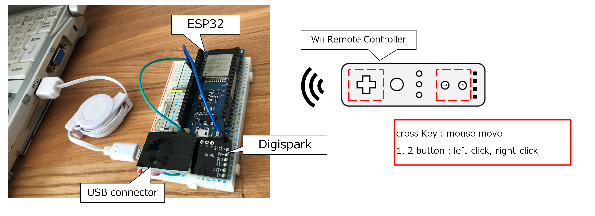
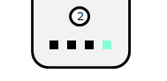

# wiimote-mouse-demo

Mouse Demo with Wii Remote Controller

  

## Requirement

- [ESP32 dev board](https://www.switch-science.com/catalog/3210/)
- ESP-IDF (xtensa-esp32-elf at the 1.22.0-80)
- [Digispark](https://www.amazon.co.jp/HiLetgo-Digispark-Kickstarter-ATTINY85-%E8%B6%85%E5%B0%8F%E5%9E%8BArduino%E4%BA%92%E6%8F%9B/dp/B07BJ2F2WZ)
- Arduino IDE (Version: 1.8.5)
- USB Connector (Micro B)

 
##  Pin connections

|USB Connector  |ESP32  |Digispark  |Note  |
|---|---|---|---|
|+5V  |VIN  |5V  ||
|GND  |GND  |GND  ||
|D+  | NC |D+  ||
|D-  | NC |D-  ||
|NC |IO25  |P0(SDA)  |pull-up in ESP32 application|
|NC |IO26  |P2(SCL)  |pull-up in ESP32 application|

## Get started 

### Setup Digispark

1. Install Arduino libraries:
   - [TinyWireS](https://github.com/rambo/TinyWire)

1. Flash [digispark-i2c2mouse.ino](./digispark-i2c2mouse/digispark-i2c2mouse.ino) to Digispark

### Setup ESP32 dev board

1. Get btstack  
```
$ git clone https://github.com/bluekitchen/btstack.git
```
2. Create Example Projects  
    * Copy [wiimote_i2c_converter.c](./wiimote_i2c_converter.c) to btstack/examples.    
    * Modify `wiimote_addr_string = "AA-AA-AA-AA-AA-AA" ` in `wiimote_i2c_converter.c` to your Wii Controller's MAC Address.

1. Copy parts of the BTstack tree into the ESP-IDF
```
$ cd port/esp32
$ ./integrate_btstack.py
```

4. Configure the serial port ※  
```
$ cd example/wiimote_i2c_converter
$ make menuconfig
```

5. Build and Flash to ESP32

```
$ make
$ make flash
```

※You can find all active COM ports by `$ ls -l /dev/serial/by-id/`.

## Usage 

1. Connect USB Connector to the USB port on your computer

1. To autoconnect, press the 1 and 2 buttons on Wii Remote

1. The LED4 will be on when they have finished connecting  
  
